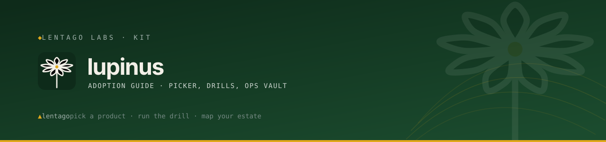

<!-- Lentago Labs brand header — generated by lentago/.github → brand/generate.py.
     Regenerate there; do not hand-edit the banner or badge URLs. -->

  

  

# lupinus

**Lupinus** is the Lentago Labs **adoption guide**: how to find the products
worth your time, get them into your own GitHub organization, and stand them up
in accounts you control — plus the ops vault you keep running them from
afterwards.

Sundial lupine is the host plant of the Karner blue, and a nitrogen-fixer that
readies lean soil for everything that grows next. That is the job here.

**Authorship:** The guide, runbooks, and documentation in this repo are
co-written with [Claude](https://claude.ai) (Anthropic). I direct the work and
review the output; Claude writes the prose. I'm an infrastructure operator, not
a software engineer — please don't read this repo as a portfolio of coding
ability.

---

## This README has two readers. Jump to yours.

### 👉 For adopters — you run a nonprofit's technology

You've got a suite of infrastructure in front of you and about an afternoon to
decide whether any of it is worth your time. This half of the README is for you.
Everything here is free to take, it runs in accounts you own, and each piece
comes with a runbook — the step-by-step instructions for standing it up. Start
here:

| Question | Page |
|---|---|
| **Which of these fits my operation?** | [The picker](guide/picker.md) |
| **How adoptable is each one, really?** | [Tiers and the agnosticism scoreboard](guide/tiers.md) |
| **Where do I actually start?** | [Your first kit](guide/first-kit.md) — free, about an hour |
| **What's true for everything here?** | [Conventions](guide/conventions.md) |
| **Where are the runbooks?** | [Runbook index](guide/runbook-index.md) |

**Want to see it working first?** Poke at our own estate before you commit to
anything: that's [asclepias](https://github.com/lentago/asclepias), volume 1 of
this guide, where you can try a change on live systems that nothing critical
rides on. This repo is volume 2 — how to make it yours.

**Then take this repository with you.** Click **Use this template** and you get
a private copy that carries the guide *and* an [ops vault](estate/README.md) — a
place to record what you run, what it depends on, what it costs, and what
happened the night it broke. Open it in [Obsidian](https://obsidian.md), a free
notes app, and the links between your notes render as a map of your estate; open
it in anything else and it's still plain Markdown that works.

**Nothing here is hosted by us.** Everything you adopt runs in accounts you own.
If you stop working with us, nothing about your systems changes — that promise is
[written down](https://github.com/lentago/.github/blob/main/docs/adr/0007-client-owned-delivery-no-multi-tenant-saas.md),
and this repository is what makes it real.

### 🔧 For maintainers — you publish a product in this suite

Your product's adoption runbook belongs **in your repository**, as `ADOPTION.md`
at the root. This repo holds the shape, not your content:

- [The ADOPTION.md template](templates/ADOPTION.md) — copy it, fill it in.
- [ADR-0003](docs/adr/0003-drill-and-receipt.md) — why the shape is what it is.
- [Tiers](guide/tiers.md) — what your product must clear to be listed as a Kit,
  and how to record what is stopping it.

The rule: **a runbook lives next to the code it operates.** Write it here only
if it genuinely spans repositories.

---

## 🧭 What this repo demonstrates

| Pattern | How it shows up here |
|---|---|
| **Docs federation without a build step** | Runbooks live in the repos they operate; this repo links and never copies. A product forked alone still carries everything it needs ([ADR-0001](docs/adr/0001-federated-hub-and-spoke.md)). |
| **Drill and receipt** | Every adoption runbook ends with a measured receipt — elapsed time, slowest step. A product cannot be listed as a Kit until someone has produced one ([ADR-0003](docs/adr/0003-drill-and-receipt.md)). |
| **Opinionation with a ratchet** | Every value carried over from our estate is a swap-list row; every structural one names a tracking issue or says "not planned". [The scoreboard](guide/tiers.md) is public and moves by pull request. |
| **Client-owned delivery, made operational** | The guide is a template: adopters take a private copy into their own org. It is the delivery rule ([ADR-0007](https://github.com/lentago/.github/blob/main/docs/adr/0007-client-owned-delivery-no-multi-tenant-saas.md)) with a green button attached. |
| **Vault-compatible by convention** | Plain `[text](path.md)` links everywhere — renders on GitHub, passes the link checker, and still builds the graph in Obsidian ([ADR-0002](docs/adr/0002-guide-repo-is-the-vault-template.md)). |

## 🛠️ Make a change yourself

**Report a runbook that let you down.** The most valuable issue anyone files
here: which step, what you expected, what happened. Adoption documentation is
only testable by people adopting.

**Add a product's `ADOPTION.md`.** Pick anything in [the picker](guide/picker.md)
without one, copy [the template](templates/ADOPTION.md), and open a PR against
*that* product's repository.

**Run a drill and publish the receipt.** Take a Kit, work its runbook, record the
number. If the number is embarrassing, that is the useful case.

## What's here

| Path | Purpose |
|---|---|
| [`guide/`](guide/picker.md) | The adoption guide — picker, tiers, conventions, tutorial, runbook index |
| [`estate/`](estate/README.md) | Your ops vault: what you run and what it depends on |
| [`journal/`](journal/README.md) | Receipts and incident notes |
| [`support/`](support/README.md) | Where to ask, and your own escalation path |
| [`templates/`](templates/README.md) | The ADOPTION, component-card, and receipt skeletons |
| [`docs/adr/`](docs/adr/README.md) | Why this guide is shaped the way it is |

In a copy of this repository, `guide/` is read-only and refreshed from upstream;
everything else is yours. See
[refreshing this guide](guide/conventions.md#refreshing-this-guide).

---

> 🌱 **Lentago Labs** is a pro-bono operations practice for organizations that
> run on volunteers, donations, and one overworked tech person. Everything here
> is free to take, and we practice what we publish: our own estate runs this
> way, in the open. Start at the [org profile](https://github.com/lentago), and
> read this repo on [DeepWiki](https://deepwiki.com/lentago/lupinus).
